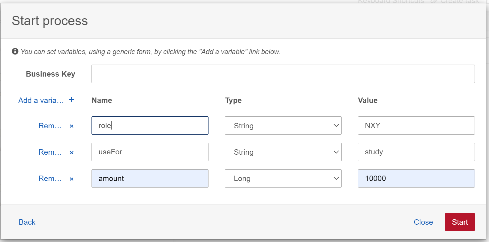
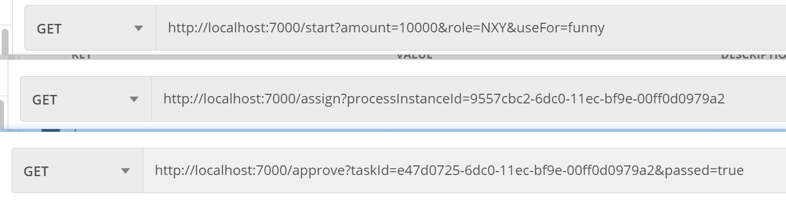
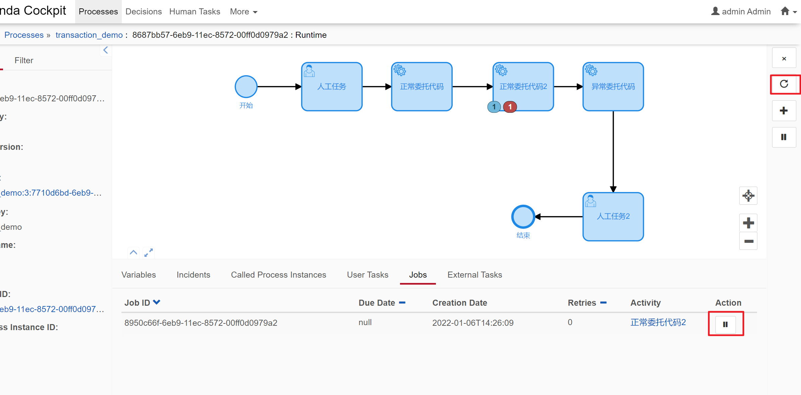

# camunda_demo
camunda+springboot

**Resource目录下的流程图说明**

1.sendMessage.bpmn:前端操作流程

调用com.example.demo.execute.SendMessageExecution Java委托类向BusinessKey是messageBusinessKey的流程实例发消息，消息名称是message

BusinessKey:启动一个流程时可以设置类似于name的值

2.receiveMessgae.bpmn:前端操作流程

定义了一个任务，用来接受name是message的消息，如果没有收到就一直卡在那一步上。

3.business.bpmn:前端操作流程

https://segmentfault.com/a/1190000022129549

一个综合性的流程，用到了异步网关、expression表达式判断流程路径、dmn决策表

测试时需要在启动流程时输入role，amount，useFor变量

4.approve_process.bpmn:可后端操作流程

流程图和3一模一样，可以用java代码走完全流程。api定义在

com.example.demo.controller.CamundaDemoController

/start 启动流程

/assign 将任务实例分给某一个人处理

/approve 完成任务

5.listener_demo.bpmn:可后端操作流程

/test 在任务那一步配置了监听器

6.audit.bpmn:前端操作流程

测试异常捕获

7.external_task_demo.bpmn: 测试外部任务，先前端开始流程，然后调用接口完成外部任务

/external

8.transaction_demo.bpmn:事务边界、异步延续测试，前端操作流程

9.parallel_demo.bpmn:并行网关、定时器，前端操作流程

10.param_demo.bpmn:java Objcet对象作为入参测试

**q1:Key/Id?**

_http://camunda-cn.shaochenfeng.com/user-guide/process-engine/process-versioning/_

RuntimeService().startProcessInstanceByKey

RuntimeService().startProcessInstanceById 两个方法都启动一个流程实例，区别是需要传入的参数不一样

key = 流程图的id 

id = 数据库的id，可以通过RepositoryService()输入流程图的id+版本号查询

普通Exception会引起camunda的事务，BpmnError不会触发事务

**q2:job?** 

_http://camunda-cn.shaochenfeng.com/user-guide/process-engine/the-job-executor/_ 

①事务回滚到Asynchronous Continuations Before位置 

②定时器

③Asynchronous handling of BPMN events

job的retries变成0时 将会生成事件Incidents 

失败事件重试：

Administrative action is necessary to reset the retries

camunda前端dashboard/processes页面找到失败的事件，点进去，点击刷新按钮(右侧或者底部Action)

**q3:定时器?**

https://www.jianshu.com/p/62955f271956 

**Date**: 固定的时间日期 ISO 8601标准 lg:2011-03-11T12:13:14Z

**Duration**: 时间段 XXX时间后 ISO 8601的两种格式 lg:PT30S 三十秒后

https://blog.csdn.net/weixin_33834910/article/details/85959587 

**Cycle**: 时间周期 cron表达式周期性的触发 ISO 8601标准/cron表达式

**基础概念**
ProcessEngineConfiguration=>ProcessEngine=>...Service 

