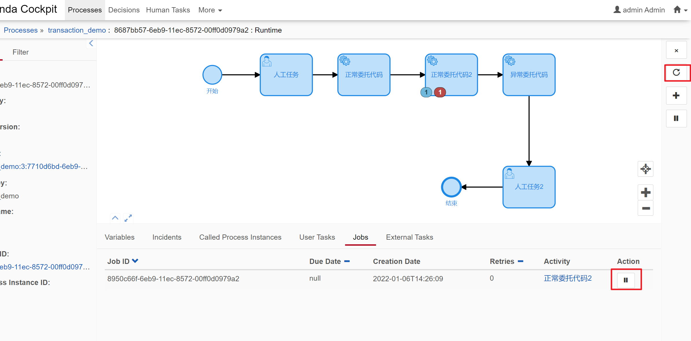

# camunda_demo
camunda+springboot 
**q1:Key/Id?** 
_http://camunda-cn.shaochenfeng.com/user-guide/process-engine/process-versioning/_
 
RuntimeService().startProcessInstanceByKey 
RuntimeService().startProcessInstanceById 两个方法都启动一个流程实例，区别是需要传入的参数不一样 
key = 流程图的id  
id = 数据库的id，可以通过RepositoryService()输入流程图的id+版本号查询 
普通Exception会引起camunda的事务，BpmnError不会触发事务  
**q2:job?**  
_http://camunda-cn.shaochenfeng.com/user-guide/process-engine/the-job-executor/_  
①事务回滚到Asynchronous Continuations Before位置  
②定时器 
③Asynchronous handling of BPMN events 

job的retries变成0时 将会生成事件Incidents  
失败事件重试： 
Administrative action is necessary to reset the retries 
camunda前端dashboard/processes页面找到失败的事件，点进去，点击刷新按钮(右侧或者底部Action) 

 
 
**q3:定时器?** 
https://www.jianshu.com/p/62955f271956  
**Date**: 固定的时间日期 ISO 8601标准 2011-03-11T12:13:14Z  
**Duration**: 时间段 XXX时间后 ISO 8601的两种格式 PT30S 三十秒后 
https://blog.csdn.net/weixin_33834910/article/details/85959587  
**Cycle**: 时间周期 cron表达式周期性的触发 ISO 8601标准/cron表达式 

**基础概念**
ProcessEngineConfiguration=>ProcessEngine=>...Service  

